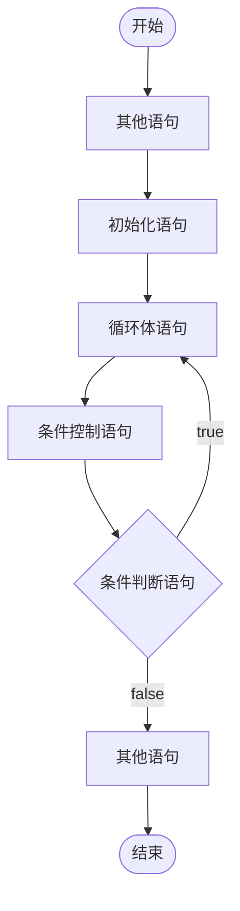

# do ... while 循环语句

## 1.1 概述

基本格式：

```java
do {
    // 循环体语句；
} while(条件判断语句);
```

完整格式：

```java
初始化语句;
do {
    循环体语句;
    条件控制语句;
}while(条件判断语句);
```

执行流程：

1. 执行初始化语句

2. 执行循环体语句

3. 执行条件控制语句

4. 执行条件判断语句，看其结果是 true 还是 false

   - 如果是 false，循环体结束

   - 如果是 true，继续执行

5. 回到流程 2 继续

do ... while 循环语句 (结构) 执行流程图：



## 1.2 参考代码

```java
/**
 * do ... while 语句
 *
 * 基本格式：
 *  do {
 *     // 循环体语句；
 *  } while(条件判断语句);
 *
 * 完整格式：
 *  初始化语句;
 *  do {
 *     循环体语句;
 *     条件控制语句;
 *  } while(条件判断语句);
 *
 *  执行流程：
 *   1.执行初始化语句
 *   2.执行循环体语句
 *   3.执行条件控制语句
 *   4.执行条件判断语句，看其结果是 true 还是 false
 *      - 如果是 false，循环结束
 *      - 如果是 true，继续执行
 *   5.回到流程 2 继续
 */
public class DoWhileDemo {
    public static void main(String[] args) {
        // 需求：在控制台输出5次"HelloWorld"
        // for循环实现
        for(int i = 1; i<= 5; i++) {
            System.out.println("HelloWorld");
        }
        System.out.println("-------");

        // do...while循环实现
        int j = 1;
        do {
            System.out.println("HelloWorld");
            j++;
        }while( j<= 5);
    }
}
```

