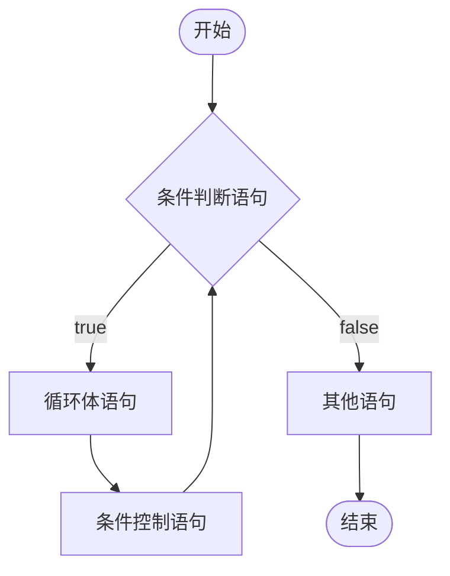

# for 循环语句

## 1.1 概述

循环结构的组成：

- 初始化语句：用于表示循环开启时的初始状态，简单说就是循环开始的时候什么样。
- 条件判断语句：用于表示循环反复执行的条件，简单说就是判断循环是否能一直执行下去。
- 循环体语句：用于表示循环反复执行的内容，简单说就是循环反复执行的事情。
- 条件控制语句：用于表示循环执行中每次变化的内容，简单说就是控制循环是否能执行下去。

<br>

循环结构对应的语法：

- 初始化语句：这里可以是一条或多条语句，这些语句可以完成一些初始化操作。

- 条件判断语句：这里使用一个结果值为 boolean 类型的表达式，这个表达式能决定是否执行循环体，

  例如：`a < 3`

- 循环体语句：这里可以是任意语句，这些语句将反复执行

- 条件控制语句：这里通常使用一条语句来改变变量的值，从每个人达到控制循环是否继续向下执行的效果。

  常见 `i++`，`i-- ` 这样的操作。

## 1.2 for 循环语句格式:

```java
for (初始化语句; 条件判断语句; 条件控制语句) {
    循环体语句;
}
```

执行流程：

1. 执行初始化语句
2. 执行条件判断语句，看其结构是 true 还是 false
   - 如果是 false，循环结束
   - 如果是 true，继续执行
4. 执行循环体语句
5. 执行条件控制语句
6. 回到流程 2 继续

for 循环语句 (结构) 执行流程图：




## 1.3 参考代码

```java
/**
 *  for语句：
 *
 *  格式:
 *      for (初始化语句; 条件判断语句; 条件控制语句) {
 *     循环体语句;
 *  }
 *  执行流程：
 *  1. 执行初始化语句
 *  2. 执行条件判断语句，看其结构是 true 还是 false
 *    - 如果是 false，循环结束
 *    - 如果是 true，继续执行
 *  3. 执行循环体语句
 *  4. 执行条件控制语句
 *  5. 回到流程 2 继续
 */
public class ForDemo {
    public static void main(String[] args) {
        // 需求：在控制台输出5次“HelloWorld”
        System.out.println("HelloWorld");
        System.out.println("HelloWorld");
        System.out.println("HelloWorld");
        System.out.println("HelloWorld");
        System.out.println("HelloWorld");
        System.out.println("--------");

        // 用循环改进
        for(int i = 1; i <= 5; i++) {
            System.out.println("HelloWorld");
        }
    }
}

```
