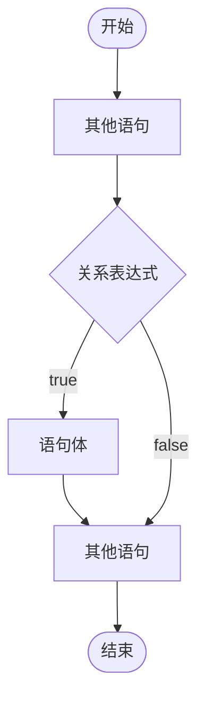
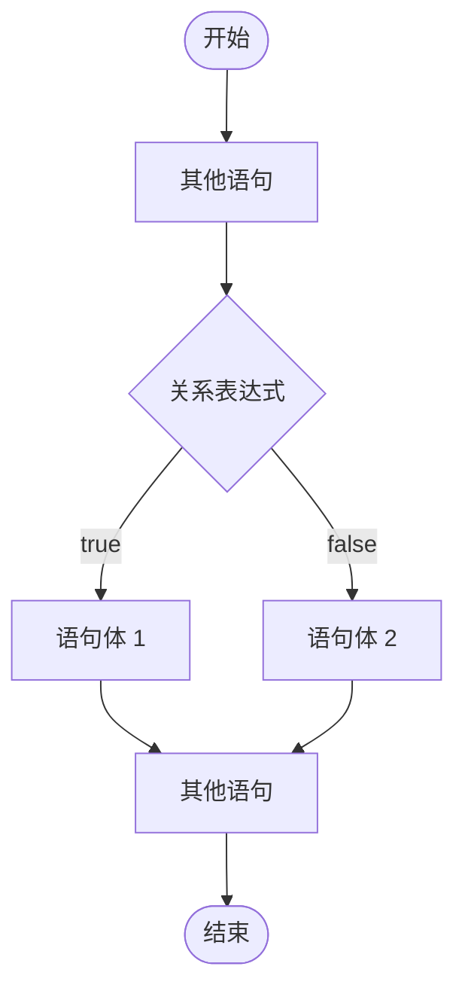
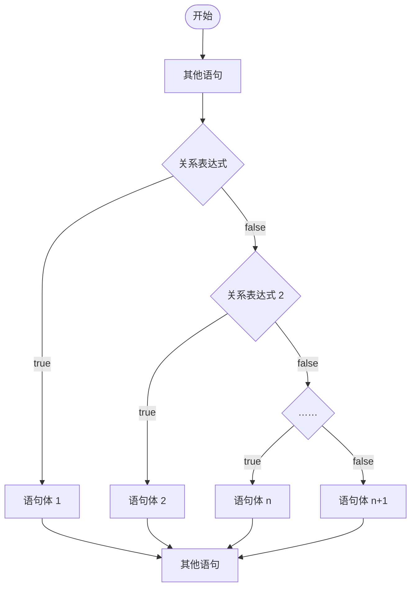

# if 语句 (结构)

## 1.1 if 语句 (格式 1)

### 1.1.1 概述

```java
if(关系表达式) {
    语句体;
}
```

执行流程：

1. 首先计算关系表达式的值
2. 如果关系表达式的值为 true 就执行语句体
3. 如果关系表达式的值为 false 就不执行语句体
4. 继续执行后面的语句内容

if 语句 (格式 1) 结构执行流程图：



### 1.1.2 参考代码

```java
/**
 * if语句格式
 *
 * 格式:
 * if(关系表达式) {
 *     语句体;
 * }
 *
 * 执行流程：
 *  1. 首先计算关系表达式的值
 *  2. 如果关系表达式的值为 true 就执行语句体
 *  3. 如果关系表达式的值为 false 就不执行语句体
 *  4. 继续执行后面的语句内容
 */
public class IfDemo {
    public static void main(String[] args) {
        System.out.println("开始");

        // 定义两个变量
        int a = 10;
        int b = 20;

        // 需求：判断a和b的值是否相等，如果相等，就在控制台输出：“a等于b”
        int c = 10;
        if(a == c) {
            System.out.println("a等于c");
        }
        System.out.println("结束");
    }
}
```

##  1.2 if 语句 (格式 2)

### 1.2.1 概述

```java
if(关系表达式) {
    语句体 1；
} else {
    语句体 2;
}
```

执行流程：

1. 首先计算关系表达式的值；
2. 如果关系表达式的值为 true 就执行语句体 1 ;
3. 如果关系表达式的值为 false 就执行语句体 2 ;
4. 继续执行后面的内容 ;

if 语句 (格式 2) 结构执行流程图：



### 1.2.2 参考代码

```java
/**
 * if 语句 (格式 2)
 *
 * if(关系表达式) {
 *     语句体 1；
 * } else {
 *     语句体 2;
 * }
 *
 * 执行流程：
 *  1. 首先计算关系表达式的值；
 *  2. 如果关系表达式的值为 true 就执行语句体 1 ;
 *  3. 如果关系表达式的值为 false 就执行语句体 2 ;
 *  4. 继续执行后面的内容 ;
 */
public class IfDemo02 {
    public static void main(String[] args) {
        System.out.println("开始");

        // 定义两个变量
        int a = 10;
        int b = 20;

        // 需求：判断a是否大于b，如果是，贼在控制台输出：”a的值大于b“，
        // 如果不是，则在控制台输出：”a的值不大于b“
        if(a > b) {
            System.out.println("a的值大于b");
        } else {
            System.out.println("a的值不大于b");
        }

        System.out.println("结束");
    }
}
```

## 1.3 if 语句 (格式 3)

### 1.3.1 概述

```java
if(关系表达式 1) {
    语句体 1;
}else if(关系表达式2) {
    语句体 2;
}
...
else {
    语句体n+1;
  }
```

执行流程：

1. 首先计算关系表达式1的值。
2. 如果值为 true 就执行语句体 1 ；如果为false就计算关系表达式 2 的值。
3. 如果值为 tru e就执行语句体 2 ；如果值为false就计算关系表达式 3 的值。
4. ……
5. 如果没有任何关系表达式为 true ，就执行语句体 n+1 。

if 语句 (格式 3) 结构执行流程图：



### 1.3.2 参考代码

```java
/**
 * if 语句 (格式 3)
 *  格式：
 *    if(关系表达式 1) {
 *        语句体 1;
 *    }else if(关系表达式2) {
 *        语句体 2;
 *    }
 *    ...
 *    else {
 *        语句体 n+1;
 *     }
 *
 * 执行流程：
 *  1. 首先计算关系表达式1的值。
 *  2. 如果值为 true 就执行语句体 1 ；如果为false就计算关系表达式 2 的值。
 *  3. 如果值为 tru e就执行语句体 2 ；如果值为false就计算关系表达式 3 的值。
 *  4. ……
 *  5. 如果没有任何关系表达式为 true ，就执行语句体 n+1 。
 */

import java.util.Scanner;

public class IfDemo03 {
    public static void main(String[] args) {
        System.out.println("开始");

        // 需求：键盘录入一个星期数(1, 2, ... 7), 输出对应的星期一、星期二、... 星期四
        Scanner sc = new Scanner(System.in);

        System.out.println("请输入一个星期数(1-7): ");
        int week = sc.nextInt();

        if(week == 1) {
            System.out.println("星期一");
        } else if(week == 2) {
            System.out.println("星期二");
        } else if(week == 3) {
            System.out.println("星期三");
        } else if(week == 4) {
            System.out.println("星期四");
        } else if(week == 5) {
            System.out.println("星期五");
        } else if(week == 6) {
            System.out.println("星期六");
        } else {
            System.out.println("星期日");
        }
    }
}
```

