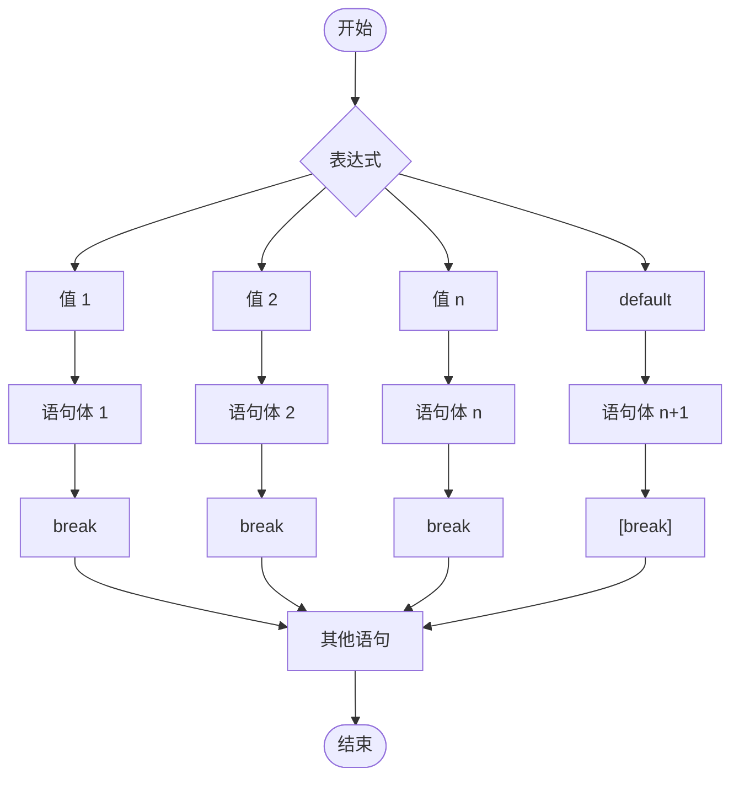

# switch 语句 (结构)

## 1.1 概述

格式：

```java
switch(表达式) {
    case 值1:
        语句体1;
        break;
    case 值2:
        语句体2;
        break;
    ...
    default:
        语句体 n+1;
        [break;]
}
```

格式说明：

- 表达式：取值为 byte、short、int、char、JDK5 以后可以是枚举，JDK7 以后可以是 String。
- case：后面跟的是要和表达式进行比较的值。
- break：表示终端，结束的意思，用来结束 switch 语句。
- default：表示所有情况都不匹配的时候，就执行该处的内容，和 if 语句的 else 相似。

switch 语句 (结构) 执行流程图：



## 1.2 参考代码

```java
import java.util.Scanner;

public class main
{
    public static void main(String[] args) {
        Scanner sc = new Scanner(System.in);

        System.out.println("Please Enter A Number.");

        int inNumber = sc.nextInt();

        switch (inNumber){
            case 1:
                System.out.println("You Enter The Number 1.");
                break;
            case 2:
                System.out.println("You Enter The Number 2.");
                break;
            case 3:
                System.out.println("You Enter The Number 3.");
                break;
            default:
                System.out.println("You Enter The Number " + inNumber + ".");
                break;
        }
    }
}
```

