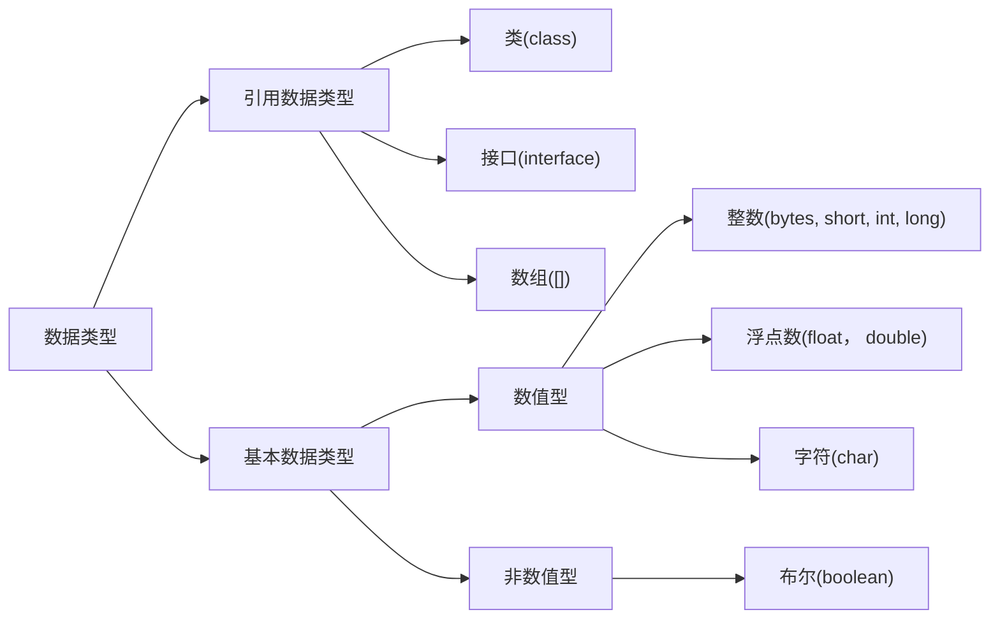

# 数据类型

## 1.1 计算机存储单元

我们知道计算机是可以用来存储数据的，但无论是内存还是硬盘，计算机存储设备的最小信息单元叫“位(bit)”，我们又称之为“比特位”，通常用小写的字母"b"表示，而计算机中最小的存储单元叫"字节(byte)", 通常用大写字母"B" 表示，字节是由连续的 8 个位组成的。

\* 说明：一个字节等于8个比特位

除了字节外还有一些常用的存储单位，大家比较熟悉，我们一起来看看：

| 存储单位           |
| ------------------ |
| 1 B（字节）= 8 bit |
| 1 KB = 1024 B      |
| 1 MB = 1024 KB     |
| 1 GB = 1024 MB     |
| 1 TB = 1024 GB     |

 

 

## 1.2  数据类型

Java 语言是强类型语言，对于每一种数据都给出了明确的数据类型，不同的数据类型也分配了不同的内存空间，所以它们表示的数据大小也是不一样的。

 

 

## 1.3 数据类型内存占用和取值范围

| 数据类型 | 关键字           | 内存占用(字节) | 取值范围                                                     |
| -------- | ---------------- | -------------- | ------------------------------------------------------------ |
| 整数     | byte             | 1              | $-128 \sim 127$                                              |
| 整数     | short            | 2              | $-32768 \sim 32767$                                          |
| 整数     | 默认 int 类型    | 4              | $-2^{31} \sim 2^{31-1}$​​​                                      |
| 整数     | long             | 8              | $-2^{63} \sim 2^{63-1}$                                      |
| 浮点数   | float            | 4              | 负数: $-3.402823E + 38$​​​ 到 $-1.401298E-45$​​​ 正数: $1.401298E + 45$​​ 到 $3.402823E+38$​​ |
| 浮点数   | 默认 double 类型 | 8              | 负数: $-1.797693 E + 308$​​​​​ 到 $-4.9000000E-324$​​​​​ 正数: $4.9000000E-324$​​​​​ 到 $1.797693E+308$​​​​​ |
| 字符     | char             | 2              | $0 \sim 65535$                                               |
| 布尔     | boolean          | 1              | 只有两个值：`true`，`false`                                  |

\* 说明：E+38 表示是乘以 10 的 38 次方，同样，E-45 表示乘以 10 的负 45 次方。

