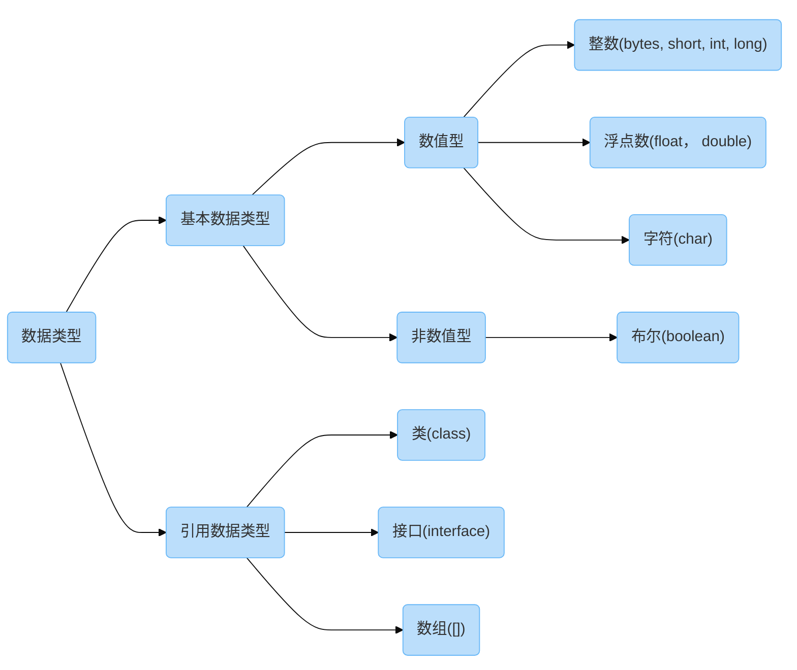

# 数据类型

## 1.1 计算机存储单元

我们知道计算机是可以用来存储数据的，但无论是内存还是硬盘，计算机存储设备的最小信息单元叫“位 ( bit )”，我们又称之为“比特位”，通常用小写的字母"b"表示，而计算机中最小的存储单元叫"字节 ( byte )"，通常用大写字母"B" 表示，字节是由连续的 8 个位组成的。(说明：一个 Byte「字节」等于8个比特位)

除了字节外还有一些常用的存储单位：

| 存储单位 | 换算    |
| -------- | ------- |
| 1 B      | 8 bit   |
| 1 KB     | 1024 B  |
| 1 MB     | 1024 KB |
| 1 GB     | 1024 MB |
| 1 TB     | 1024 GB |

## 1.2  数据类型

Java 语言是强类型语言，对于每一种数据都给出了明确的数据类型，不同的数据类型也分配了不同的内存空间，所以它们表示的数据大小也是不一样的。

## 1.3 数据类型内存占用和取值范围

| 数据类型 | 关键字            | 内存占用(字节) | 取值范围                                                     |
| -------- | ----------------- | -------------- | ------------------------------------------------------------ |
| 整数     | byte              | 1              | `-128 ~ 127`                                                 |
| 整数     | short             | 2              | `-32768 ~ 32767`                                             |
| 整数     | int (默认类型)    | 4              | <code>-231 ~ 231​-1</code>              |
| 整数     | long              | 8              | <code>-263 ~ 263-1</code>              |
| 浮点数   | float             | 4              | `-3.402823E+38`   ~  ` -1.401298E-45`  `+1.401298E+45`  ~   `+3.402823E+38` |
| 浮点数   | double (默认类型) | 8              | `-1.797693E+308`  ~ ` -4.900000E-324` `+4.900000E-324`  ~  `+1.797693E+308` |
| 字符     | char              | 2              | `0 ~ 65535`                                                  |
| 布尔     | boolean           | 1              | `true`，`false`                                              |

\* 说明：E+38 表示是乘以 10 的 38 次方，同样，E-45 表示乘以 10 的负 45 次方。

