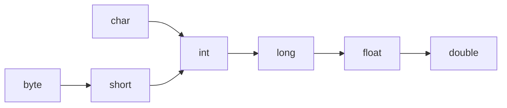

# 类型转换

## 1.1类型转换分类

- 自动类型转换
- 强制类型转换

## 1.2 自动类型转换

把一个表示数据范围小的数值或者变量赋值给另一个表示数据范围大的变量
范例：double d = 10;

**表示数据范围从小到大：**



==int类型转换为double类型：==

```java
public class main
{
    public static void main(String[] args)
    {
        // 自动类型转换
        double d = 10;

        System.out.println(d);
    }
}
```

```java
10.0
```

==byte类型转换为short及其他类型转换==

```java
public class main
{
    public static void main(String[] args)
    {
        // byte类型转换为short及其他类型转换**
        byte b = 10;
        short s = b;
        int i = b;

        System.out.println(s);
        System.out.println(i);
    }
}
```

```java
10
10
```

==byte类型不能自动转换为char类型：==

```java
public class main
{
    public static void main(String[] args)
    {
        // 从byte转换到char
        byte b = 10;
        char c = b;

        System.out.println(c);
    }
}
```

```java
java: 不兼容的类型: 从byte转换到char可能会有损失
```

## 1.3 强制类型转换

把一个表示数据 ==范围大的数值== 或 ==变量== 赋值给另一个表示数据 ==范围小的变量==

- 格式：`目标数据类型 变量名 = (目标数据类型) 值或变量;`

```java
public class main
{
    public static void main(String[] args)
    {
        // 强制类型转换
        int k = (int) 88.88;

        System.out.println(k);
    }
}
```

```java
88
```

