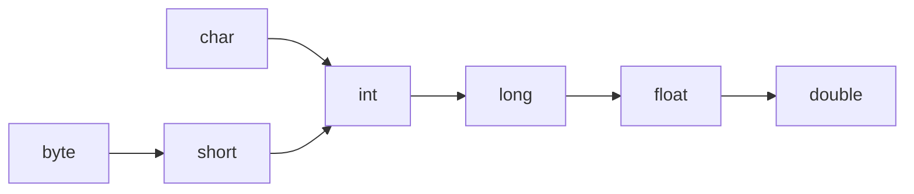

# 类型转换

## 1.1 类型转换分类

类型转换的分类：

- 自动类型转换
- 强制类型转换

## 1.2 自动类型转换

把一个表示数据范围小的数值或者变量赋值给另一个表示数据范围大的变量。

范例：`double d = 10;`

表示数据范围从小到大：



## 1.3 强制类型转换

把一个表示数据范围大的数值或 变量赋值给另一个表示数据范围小的变量。

格式：目标数据类型 变量名 = (目标数据类型) 值或变量;<br>
范例：`int k = (int) 88.88;`

## 1.4 参考代码

```java
/**
 * 类型转换
 */
public class ConversionDemo {
    public static void main(String[] args) {
        // 自动类型转换
        double d = 10;
        System.out.println(d);

        // 定义byte类型的变量
        byte b = 10;
        short a = b;
        int i = b;

        // 这是不可以的，类型不兼容
        // char c = b;

        // 强制类型转换
        int k = (int)13.14;
        System.out.println(k);
    }
}
```


