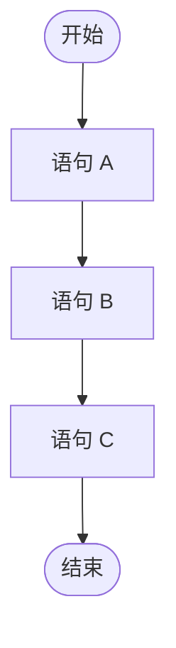

# 流程控制 (顺序结构)

## 1.1 流程控制语句概述

在 Java 程序中，JVM 默认总是顺序执行以分号 `;` 结束的语句。但是，在实际的代码中，程序经常需要做条件判断、循环，因此，需要有多种流程控制语句，来实现程序的跳转和循环等功能。

## 1.2 流程控制语句分类

- 顺序结构
- 分支结构 (if,  switch )
- 循环结构 ( for,  while,  do ... while)

## 1.2 顺序结构

顺序结构是程序中最简单最基本额度流程控制，没有特定的语法结构，按照代码的先后顺序，依次执行，程序中大多数的代码都是这样执行的。

顺序结构执行流程图：



## 1.3 参考代码

```java
/**
 * 顺序结构
 */
public class OrderDemo {
    public static void main(String[] args) {
        System.out.println("开始");

        System.out.println("语句 A");
        System.out.println("语句 B");
        System.out.println("语句 C");

        System.out.println("结束");

    }
}
```


