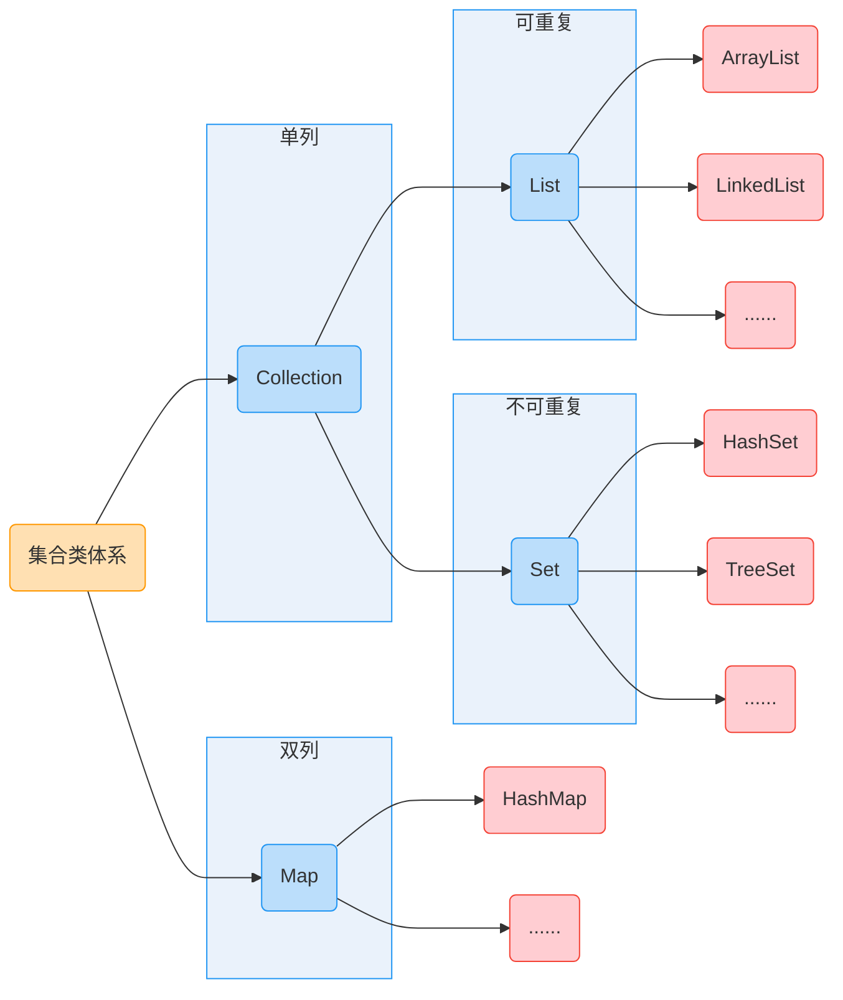

# Collection

## 1.1 集合类的特点

集合类的特点：提供了一种存储空间可变的存储模型，存储的数据容量可以随时发生改变

## 1.2 集合类体系结构



**==注==：图中蓝色图示均为接口，红色图示均为其对应实现类**

## 1.3 Collection 集合的概述和使用

### 1.3.1 Collection 集合概述

- 是单列集合的顶层接口，它表示一组对象，这些对象也称为 Collection 元素
- JDK 不提供此接口的任何直接实现，它提供更具体的子接口(如 Set 和 List )实现

### 1.3.2 创建 Collection 集合的对象

- 多态的方式
- 具体的实现类 ArrayList

### 1.3.3 参考代码

```java
import java.util.ArrayList;
import java.util.Collection;

/**
 * 创建Collection集合的对象
 * 多态的方式
 * ArrayList()
 */
public class CollectionDemo01 {
    public static void main(String[] args) {
        // 创建Collection集合的对象
        Collection<String> c = new ArrayList<String>();

        // 添加元素：boolean add(E e)
        c.add("hello");
        c.add("world");
        c.add("java");

        // 输出集合对象
        System.out.println(c);
    }
}

```

## 1.4 Collection 集合常用方法

### 1.4.1 常用方法

| 方法名                       | 说明                               |
| ---------------------------- | ---------------------------------- |
| `boolean add(E e)`           | 添加元素                           |
| `boolean remove(Object o)`   | 从集合中移除指定元素               |
| `void clear()`               | 清空集合中的元素                   |
| `boolean contains(Object o)` | 判断集合中是否存在指定的元素       |
| `boolean isEmpty()`          | 判断集合是否为空                   |
| `int size()`                 | 集合的长度，也就是集合中元素的个数 |

### 1.4.2 参考代码

```java
/**
 * Collection 集合常用方法：
 *  boolean add(E e)：添加元素
 *  boolean remove(Object o)：从集合中移除指定的元素
 *  void clear()：清空集合中的元素
 *  boolean contains(Object o)：判断集合中是否存在指定的元素
 *  boolean isEmpty()：判断集合是否为空
 *  int size()：集合的长度，也就是集合中元素的个数
 *
 *  Alt + 7 快捷键，可以打开一个窗口能看到类的所有信息
 */
public class CollectionDemo02 {
    public static void main(String[] args) {
        // 创建Collection集合的对象
        Collection<String> c = new ArrayList<String>();

        // boolean add(E e)：添加元素
        // System.out.println(c.add("hello"));
        // System.out.println(c.add("world"));
        // System.out.println(c.add("world"));
        c.add("hello");
        c.add("world");
        c.add("java");

        // boolean remove(Object o)：从集合中移除指定的元素
        // System.out.println(c.remove("world"));
        // System.out.println(c.remove("javaee"));

        // void clear()：清空集合中的元素
        // c.clear();
        
        // boolean contains(Object o)：判断集合中是否存在指定的元素
        // System.out.println(c.contains("world"));
        // System.out.println(c.contains("javaee"));
        
        // boolean isEmpty()：判断集合是否为空
        // System.out.println(c.isEmpty());
        
        // int size()：集合的长度，也就是集合中元素的个数
        System.out.println(c.size());

        // 输出集合对象
        System.out.println(c);
    }
}

```

## 1.5 Collection 集合的遍历

### 1.5.1 Iterator 迭代器概述

Iterator 迭代器，集合的专用遍历方式：
- `Iterator<E> iterator()`：返回此集合元素中的迭代器，通过集合的 `iterator()` 方法得到
- 迭代器是通过集合的 `iterator()` 方法得到的，所以我们说它是依赖于集合而存在的

Iterator 迭代器中的常用方法：
- `E next()`：返回迭代中的下一个元素
- `boolean hasNext()`：如果迭代具有更多元素，则返回 true

### 1.5.2 参考代码

```java
import java.util.ArrayList;
import java.util.Collection;
import java.util.Iterator;

/**
 * Iterator：迭代器，集合的专用遍历方式
 *  Iterator<E> iterator()：返回此集合中元素的迭代器，通过集合的iterator()方法得到
 *  迭代器是通过iterator()方法得到的，所以我们说它是依赖于集合而存在的
 *
 * Iterator中的常用方法
 *  E next()：返回集合中的下一个元素
 *  boolean hasNext()：如果迭代具有更多元素，则返回true
 */
public class IteratorDemo {
    public static void main(String[] args) {
        // 创建集合对象
        Collection<String> c = new ArrayList<String>();

        c.add("hello");
        c.add("world");
        c.add("java");

        // Iterator<E> iterator()：返回此集合中元素的迭代器，通过集合的iterator()方法得到
        Iterator<String> it = c.iterator();

        /*
        public Iterator<E> iterator() {
            return new ArrayList.Itr();
        }

        private class Itr implements Iterator<E> {
            ....
        }
         */

        // E next()：返回迭代中的下一个元素
        /*
        System.out.println(it.next());
        System.out.println(it.next());
        System.out.println(it.next());
        System.out.println(it.next());  
        // NoSuchElementException：表示被请求的元素不存在
         */

        // boolean hasNext()：如果迭代器具有更多元素，则返回true
        /*
        if(it.hasNext()) {
            System.out.println(it.next());
        }
        if(it.hasNext()) {
            System.out.println(it.next());
        }
        if(it.hasNext()) {
            System.out.println(it.next());
        }
        if(it.hasNext()) {
            System.out.println(it.next());
        }
         */

        // 用while循环改进判断
        while(it.hasNext()) { 
            // System.out.println(it.next());
            String s = it.next();
            System.out.println(s);
        }
    }
}
```

## 1.6 集合的使用步骤

<br>


==Sorce Link==：[查看幻灯片文件](https://1drv.ms/p/s!Atmd1rID6xjMhLVoktJOiTR3_Y4v1A)

## 1.7 案例: Collecton集合存储学生对象并遍历

### 1.7.1 案例概述

需求：创建一个存储学生对象的集合，存储三个学生对象，使用程序实现在控制台遍历该集合

思路：

1.  定义学生类
2.  创建 Collection 集合对象
3.  创建学生对象
4.  把学生添加到集合
5.  遍历集合(迭代器方式)

### 1.7.2 代码实现

==CollectionDemo==

```java
public class CollectionDemo {
    public static void main(String[] args) {
        // 创建 Collection 集合对象
        Collection<Student> collection = new ArrayList<>();

        // 创建学生对象
        Student s1 = new Student("Linda", 20);
        Student s2 = new Student("Mika", 35);
        Student s3 = new Student("Wing", 33);

        // 把学生添加到集合
        collection.add(s1);
        collection.add(s2);
        collection.add(s3);

        // 遍历集合(迭代器方式)
        Iterator<Student> iterator = collection.iterator();
        while(iterator.hasNext()) {
            Student student = iterator.next();
            System.out.println(student.toString());
        }

    }
}
```

==Student==

```java
public class Student {
    private String name;
    private int age;

    public Student() {
    }

    public Student(String name, int age) {
        this.name = name;
        this.age = age;
    }

    public String getName() {
        return name;
    }

    public void setName(String name) {
        this.name = name;
    }

    public int getAge() {
        return age;
    }

    public void setAge(int age) {
        this.age = age;
    }

    @Override
    public String toString() {
        return "Student{" +
                "name='" + name + '\'' +
                ", age=" + age +
                '}';
    }
}
```