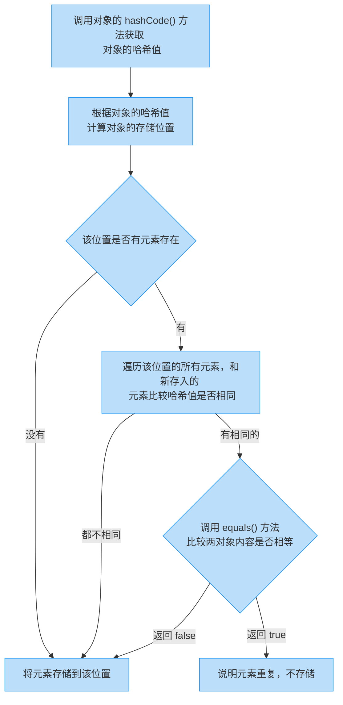

# HashSet 集合保证元素唯一性源码分析

## 1.1 概述

HashSet 集合存储元素

- 需要保证元素唯一性，需要重写 `hashCode()` 和 `equals()` 方法

HashSet 集合添加一个元素的过程(如下图所示)：



## 1.2 源码分析

```java
// 创建集合对象
HashSet<String> hashSet = new HashSet<String>();

// 添加元素
hashSet.add("hello");
hashSet.add("world");
hashSet.add("java");

public boolean add(E e) {
    return map.put(e, PRESENT) == null;
}

static final int hash(Object key) {  // key 为元素
    int h;
    return (key == null) ? 0 : (h = key.hashCode()) ^ (h >>> 16);
}

public V put(K key, V value) {
    return putVal(hash(key), key, value, false, true);
}

// hash 值和元素的 hashCode() 方法有关
final V putVal(int hash, K key, V value, boolean onlyIfAbsent,
               boolean evict) {
    Node<K,V>[] tab; Node<K,V> p; int n, i;
    // 如果哈希表未初始化，就对其进行初始化
    if ((tab = table) == null || (n = tab.length) == 0)
        n = (tab = resize()).length;
    // 根据对象的哈希值计算对象的存储位置，如果该位置没有元素，就存储元素
    if ((p = tab[i = (n - 1) & hash]) == null)
        tab[i] = newNode(hash, key, value, null);
    else {
        Node<K,V> e; K k;
        /**
         * 存入的元素和以前的元素比较哈希值
         * 	└- 如果哈希值不同，会继续执行，把元素添加到集合
         *  └- 如果哈希值相同，会调用对象的 equals() 方法比较
         *	    └- 如果返回 false，会继续向下执行，把元素添加到集合
         *      └- 如果返回 true，说明元素重复，不存储
         */
        if (p.hash == hash &&
            ((k = p.key) == key || (key != null && key.equals(k))))
            e = p;
        else if (p instanceof TreeNode)
            e = ((TreeNode<K,V>)p).putTreeVal(this, tab, hash, key, value);
        else {
            for (int binCount = 0; ; ++binCount) {
                if ((e = p.next) == null) {
                    p.next = newNode(hash, key, value, null);
                    if (binCount >= TREEIFY_THRESHOLD - 1) // -1 for 1st
                        treeifyBin(tab, hash);
                    break;
                }
                if (e.hash == hash &&
                    ((k = e.key) == key || (key != null && key.equals(k))))
                    break;
                p = e;
            }
        }
        if (e != null) { // existing mapping for key
            V oldValue = e.value;
            if (!onlyIfAbsent || oldValue == null)
                e.value = value;
            afterNodeAccess(e);
            return oldValue;
        }
    }
    ++modCount;
    if (++size > threshold)
        resize();
    afterNodeInsertion(evict);
    return null;
}
```
