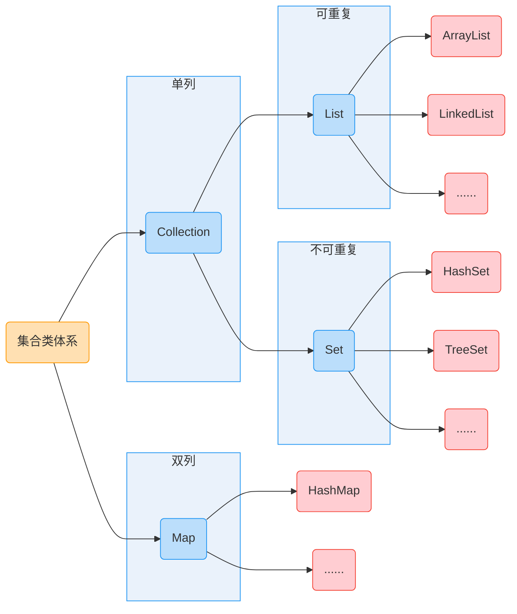

# 集合体系结构

## 1.1 集合知识回顾

集合类的特点：提供了一种存储空间可变的存储模型，存储的数据容量可以随时发生改变

## 1.2 集合类体系结构

```mermaid

graph LR;
C("集合类体系"):::mainClass
Co("Collection")
M("Map")
L("List")
S("Set")
AL("ArrayList"):::objectClass
LL("LinkedList"):::objectClass
more_1("......"):::objectClass
more_2("......"):::objectClass
more_3("......"):::objectClass
HS("HashSet")
TS("TreeSet"):::objectClass
HM("HashMap")

C --> Co & M
subgraph H["单列"]
	Co
end
Co:::interfaceClass --> L & S
subgraph G["双列"]
	M
end
subgraph F["可重复"]
	L
end
subgraph E["不可重复"]
	S
end
L:::interfaceClass --> AL:::objectClass & LL & more_1
S:::interfaceClass --> HS:::objectClass & TS & more_2
M:::interfaceClass --> HM:::objectClass & more_3

classDef subGraph fill:#eaf2fb, stroke:#2196f3;
classDef interfaceClass fill:#bbdefb, stroke:#2196f3;
classDef objectClass fill:#ffcdd2, stroke:#f44336;
classDef mainClass fill:#ffe0b2, stroke:#ff9800;

 class E,F,G,H subGraph;

 %%subgraph 图示
	%% Interface["接口均为矩形表示"]
	%% Implement(["其实现类为圆角矩形表示"])
%%end
%% style 图示 fill:#eeeeee, stroke:#262c33;
```

\* 注释：图中蓝色图示均为接口，红色图示均为其对应实现类